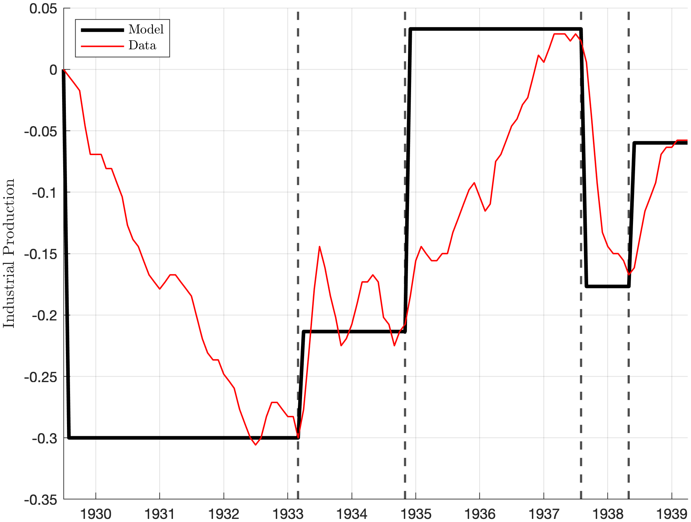

---

##### Download

+ [Paper](eggertsson_schule_fgp.pdf)

---

##### Abstract

In standard New Keynesian models, future interest rate cuts have larger effects than current cuts—a phenomenon known as the forward guidance puzzle. We argue that this puzzle arises from a radical policy-regime change assumption: between announcement and implementation, the central bank commits never to respond to inflation and output. Once standard policy responses are restored, the puzzle disappears. We test whether genuine regime changes at the zero lower bound generate the model's predicted effects by examining four Depression-era episodes which are empirically comparable: Roosevelt's 1933 gold exit and reflation pledge, Eccles's 1934 appointment, the "Mistake of 1937" and the 1938 reversal. Calibrating a minimalistic New Keynesian model to term-structure movements, we find predicted output swings of 10-25\% match the data within percentage points. The forward guidance puzzle is thus a feature, not a bug—one that helps explain dramatic historical episodes when monetary regimes credibly shifted.

---

##### Figure 3a: Response to Forward Guidance Shocks in the Model and in the Data



---

##### Citation

Eggertsson, Gauti B., and Finn Schüle. 2024. "The Forward Guidance Puzzle is Not a Puzzle." *NBER Working Paper* 33180. https://www.nber.org/system/files/working_papers/w33180/w33180.pdf.

```BibTeX
@article{ES24,
author = {Gauti B. Eggertsson and Finn Schüle},
year = {2024},
title ={The Forward Guidance Puzzle is Not a Puzzle},
journal = {NBER Working Paper},
volume = {33180},
url = {https://www.nber.org/system/files/working_papers/w33180/w33180.pdf}}
```
