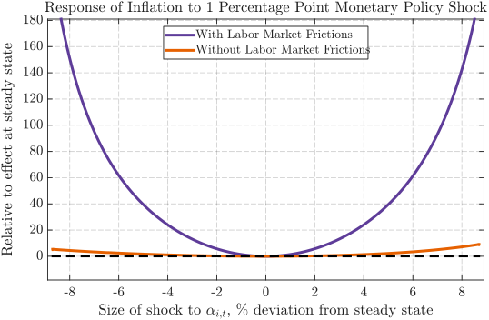

---

##### Download

+ [**Job Market Paper**](JMP_Finn_Schuele.pdf)

---

##### Abstract

I develop a New Keynesian model with input-output linkages, search-and-matching frictions, and sticky prices to study how sector-specific shocks affect output and inflation. Firms draw workers from a common labor pool, creating a novel labor market propagation channel: higher demand in one sector raises wages and job-finding rates there, redirects job search, and increases hiring costs elsewhere. Solving the model nonlinearly shows that sectors' importance for inflation and monetary policy is state-dependent---sectors with tighter labor markets raise prices more in response to demand or supply changes.The resulting Phillips curve steepens as tightness (vacancies over unemployment) rises, consistent with recent evidence, implying that monetary policy has larger effects on inflation but smaller effects on output when some sectors are tight. Calibrated to U.S. data, the model shows that the post-COVID shift toward goods demand alone explains about 2.8 percentage points of inflation and much of the observed decline in matching efficiency.

---

##### Figure 7b: Effect of -1% Monetary Policy Shock on Inflation Relative to Effect at Steady State 



---


##### Citation

Schüle, Finn. 2025. "The Phillips and Beveridge Curves in a Multi-Sector Economy."

```BibTeX
@article{Schule25,
author = {Finn Schüle},
year = {2025},
title ={The Phillips and Beveridge Curves in a Multi-Sector Economy}
}
```
