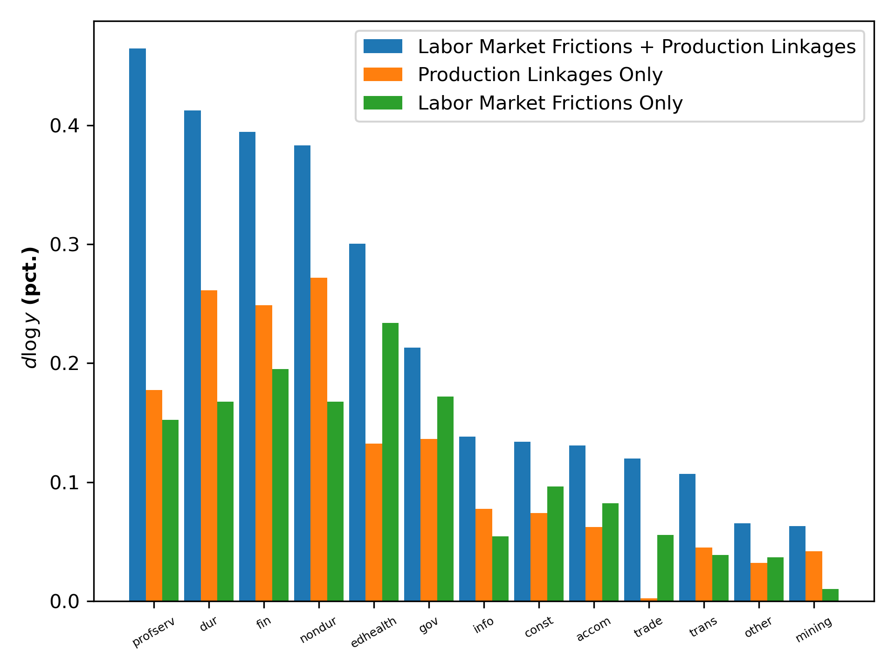

---

##### Download

+ [Paper](schule_sheng_upn.pdf)

---

##### Abstract

We model a production network economy with sectoral and occupational unemployment by incorporating matching between job seekers across various occupations and employers in different production sectors. We derive expressions that unpack how the impact of microeconomic shocks on output and unemployment depends on the interaction between the network linkages, search costs, and changes in labor market tightness. When labor markets are slack, our model predicts larger output and employment responses because the network-adjusted labor productivity gain outweighs search costs. Calibrating our model to the U.S. economy, we demonstrate that our model significantly amplifies the response of aggregate output and unemployment to productivity shocks in any sector and changes the relative importance of sectors to aggregate output and unemployment. Our model nearly doubles the output response compared to an efficient production network and triples the unemployment response compared to a multi-sector search model following a productivity shock to durable manufacturing.

---

##### Figure 3a: Response of aggregate output to 1% productivity shock in each sector



---

##### Citation

Schüle, Finn, and Haoyu Sheng. 2023. "Unemployment in a Production Network" *Working Paper*.

```BibTeX
@article{SS24,
author = {Finn Schüle and Haoyu Sheng},
year = {2023},
title ={Unemployment in a Production Network},
journal = {Working Paper}}
```