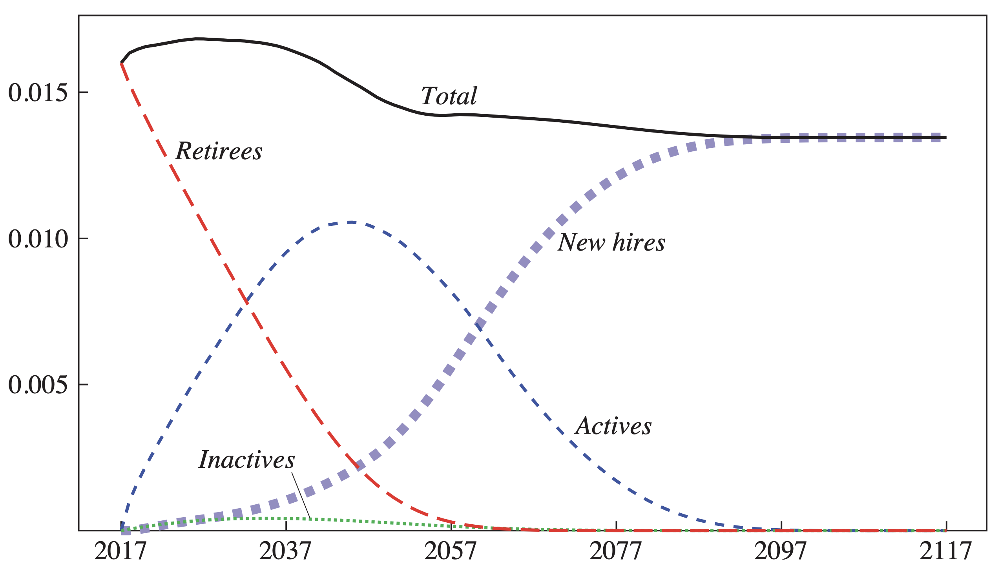

---

##### Download

+ [Paper](llss_sustainability.pdf)

---

##### Abstract

In this paper we explore the fiscal sustainability of US state and local government pension plans. Specifically, we examine whether, under current benefit and funding policies, state and local pension plans will ever become insolvent and if so, when. We then examine the fiscal cost of stabilizing pension debt as a share of the economy and examine the cost associated with delaying such stabilization into the future. We find that, despite the projected increase in the ratio of beneficiaries to workers as a result of population aging, state and local government pension benefit payments as a share of the economy are currently near their peak and will eventually decline significantly. This previously undocumented pattern reflects the significant reforms enacted by many plans which lower benefits for new hires and cost-of-living adjustments often set beneath the expected pace of inflation. Under low or moderate asset return assumptions, we find that few plans are likely to exhaust their assets over the next few decades. Nonetheless, under these asset returns, plans are currently not sustainable as pension debt is set to rise indefinitely; plans will therefore need to take action to reach sustainability. But the required fiscal adjustments are generally moderate in size and in all cases are substantially lower than the adjustments required under the typical full prefunding benchmark. We also find generally modest returns, if any, to starting this stabilization process now versus a decade in the future. Of course, there is significant heterogeneity, with some plans requiring very large increases to stabilize their pension debt.

---

##### Figure 3: US Aggregate Ratio of Benefit Payments to GDP



---

##### Citation

Lenney, Jamie., Byron Lutz, Finn Schüle, and Louise Sheiner. 2021. "The Sustainability of State and Local Pensions: A Public Finance Approach " *Brookings Papers on Economic Analysis* 2021 (2): 1-48. https://www.brookings.edu/wp-content/uploads/2021/03/15872-BPEA-SP21_WEB_Lenney-et-al.pdf.

```BibTeX
@article{llss21,
author = {Jamie Lenney, Byron Lutz , Finn Schüle , and Louise Sheiner},
year = {2021},
title ={The Sustainability of State and Local Pensions: A Public Finance Approach },
journal = {Brookings Papers on Economic Activity},
volume = {2021},
number={2},
pages = {1-48},
url = {https://www.brookings.edu/wp-content/uploads/2021/03/15872-BPEA-SP21_WEB_Lenney-et-al.pdf}}
```
